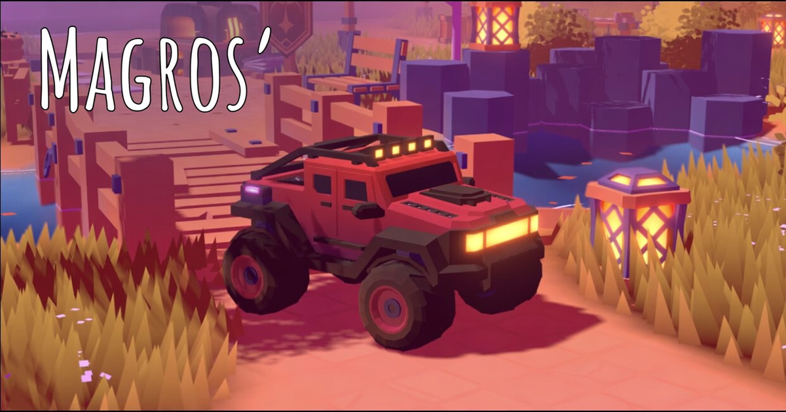

# Folio 2025

Interactive 3D portfolio built with Three.js, Rapier physics and Vite — an explorable game-like world served as an online résumé.

> Remote: `https://github.com/majinmagros/folio-2025.git` (branch `main`)

## 🔗 Acesso online

| | URL |
|---|---|
| **Site (GitHub Pages)** | https://majinmagros.github.io/folio-2025/ |
| **Repositório** | https://github.com/majinmagros/folio-2025 |



## Features

- Fully interactive 3D world (WASD + mouse) powered by **Three.js** and **Rapier** physics.
- Game loop organized in named phases (see "Update loop").
- Areas (zones) with distinct content: Home, Social, Achievements, Whispers, and more.
- Day / Year cycles and dynamic weather (wind, rain, snow, lightnings, fog, tornado).
- Instanced foliage, terrain, trails, water, explosives crates, lanterns, fences, benches.
- Audio layer (Howler) with contextual notifications.
- `data/*.js` files drive: social links, areas, whispers, sites and map markers.
- Debug UI via **Tweakpane** (+ camerakit & essentials plugins).

## Setup

Create a `.env` file based on `.env.example`:

```
VITE_SERVER_URL=
VITE_ANALYTICS_TAG=
VITE_GAME_PUBLIC=
VITE_COMPRESSED=
VITE_DAY_CYCLE_PROGRESS=
VITE_YEAR_CYCLE_PROGRESS=
VITE_WHISPERS_COUNT=30
VITE_MUSIC=1
VITE_LOG=1
VITE_PLAYER_SPAWN=
```

Install [Node.js](https://nodejs.org/en/download/) and run:

```bash
# Install dependencies
npm install --force

# Serve locally (vite dev server)
npm run dev

# Build for production into the dist/ directory
npm run build

# Preview the production build
npm run preview

# Compress GLB / textures / UI (WebP)
npm run compress
```

Config lives in `vite.config.js`:
- `root: sources/` and `publicDir: ../static/`.
- `envDir: ../` (env is loaded from the repo root via `dotenv`).
- `build.outDir: '../dist'`, `base: './'`.

## Project structure

```
folio-2025/
├─ sources/          # entry (index.html) + application source
│  ├─ data/          # content data (social, achievements, whispers, etc.)
│  ├─ Game/          # game engine (World, Areas, physics, loop, etc.)
│  └─ style/
├─ static/           # public assets served as-is
│   ├─ social/       # README/social share image
│   ├─ ui/           # UI sprites, flags, map, previews
│   └─ models/       # 3D assets (GLB) and textures
├─ scripts/          # compress.js (GLB + texture optimization)
├─ resources/        # raw/source assets (not served)
├─ .env.example
└─ vite.config.js
```

## Update loop

Phase 0 ...

```
0   Time, Inputs
1   Player:pre-physics (Inputs)
2   PhysicalVehicle:pre-physics (Player:pre-physics)
3   Physics
4   PhysicsWireframe (Physics), Objects (Physics)
5   PhysicalVehicle:post-physics (Player:pre-physics)
6   Player:post-physics (Physics, PhysicalVehicle:post-physics)
7   View (Inputs, Player:post-physics)
8   Intro, DayCycles, YearCycles, Weather, Zones, VisualVehicle
9   Wind, Lighting, Tornado, InteractivePoints, Tracks
10  Area, Foliage, Fog, Reveal, Terrain, Trails, Floor, Grass,
    Leaves, Lightnings, Rain, Snow, VisualTornado, WaterSurface,
    Benches, Bricks, ExplosiveCrates, Fences, Lanterns, Whispers
13  InstancedGroup (Objects)
14  Audio, Notifications, Title
998 Rendering
999 Monitoring
```

## Blender

### Export

- Mute the palette texture node (it is loaded and set in the Three.js `Material` directly).
- Use the corresponding export presets.
- Don't compress at export (done later by the pipeline).

### Compress

```bash
npm run compress
```

Runs `scripts/compress.js static/` and:

- **GLB** — traverses `static/` for `.glb` (skipping already-compressed), compresses embedded textures with `etc1s --quality 255` (lossy, GPU friendly), generates new files preserving originals.
- **Texture files** — traverses `static/` for `png|jpg` (skipping non-model folders), compresses with default or per-path preset.
- **UI files** — traverses `static/ui/` for `png|jpg`, encodes to WebP.

Resources:
- https://gltf-transform.dev/cli
- https://github.com/KhronosGroup/KTX-Software
- https://github.khronos.org/KTX-Software/ktxtools/toktx.html

## Key dependencies

Three.js, @dimforge/rapier3d, gsap, howler, tweakpane, camera-controls, vite (v7), and related plugins (wasm, top-level-await, restart, basic-ssl, node-polyfills).

## 🚢 Implantação

Publicado automaticamente via **GitHub Pages** a partir da branch `main`:

- Workflow: `.github/workflows/pages.yml` (build `npm run build` → `dist/` → deploy-pages).
- Endereço do deploy: https://majinmagros.github.io/folio-2025/

Qualquer `git push` para `main` atualiza o Pages em poucos minutos.

---
*Docs generated with verified facts from the repository (package.json, vite.config, folders).*